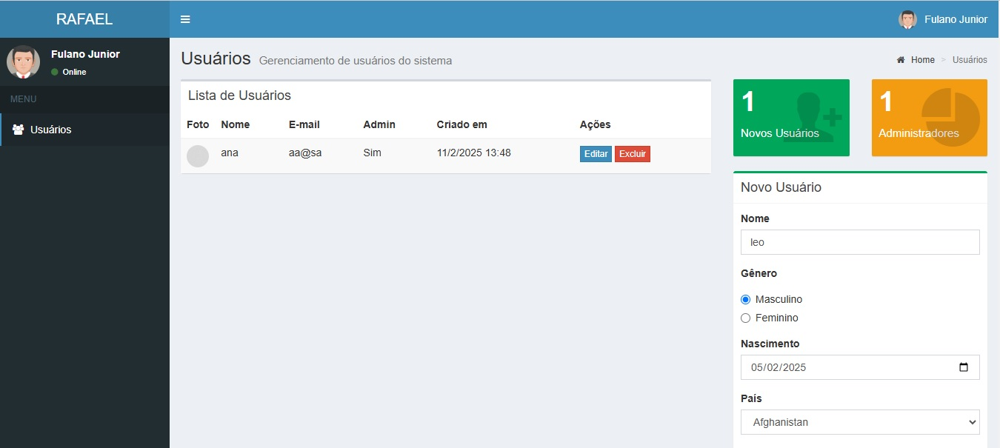

# 📌 Projeto Cadastro de Usuarios

Este projeto é um sistema de gerenciamento de usuários que permite criar, editar e excluir usuários de forma eficiente.

## 🚀 Tecnologias Utilizadas

- HTML5 & CSS3
- JavaScript (ES6+)
- Bootstrap
- LocalStorage / SessionStorage

## ⚙️ Funcionalidades

✅ Adicionar novos usuários com foto, nome, e-mail, gênero e status de administrador.  
✅ Editar informações do usuário existente.  
✅ Excluir usuários da lista.  
✅ Armazenamento dos usuários no LocalStorage.  
✅ Contagem dinâmica de usuários cadastrados e administradores.  

## 📜 Como Usar

1. Clone este repositório:
   ```sh
   git clone https://github.com/rafaelflorentinobarbosa/ProjetoUsuarios.git
    ```

## 💻 Link do Projeto

Segue o link do site Cadastro de Usuários: [CLIQUE AQUI](https://rafaelflorentinobarbosa.github.io/ProjetoUsuarios/)

Segue o link no Versel: [CLIQUE AQUI](http://127.0.0.1:5500/index.html)

## 📜 Licença
Este projeto é de uso livre. Fique à vontade para contribuir! 🤝

🎶 *"A vida sem música seria um erro."* - Friedrich Nietzsche
